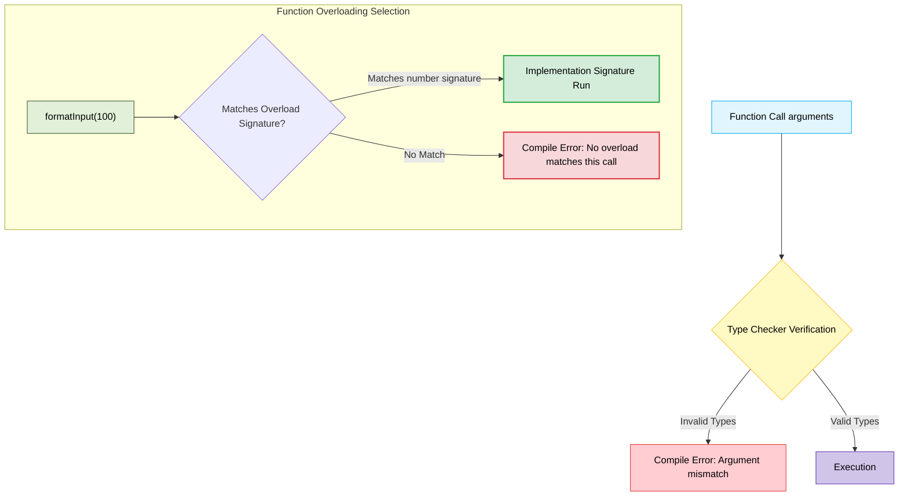

# Chapter 03: Functions 🛑

TypeScript-এ ফাংশন হলো অন্যতম গুরুত্বপূর্ণ অংশ। JavaScript-এর তুলনায় TypeScript-এ ফাংশনের প্যারামিটার এবং রিটার্ন টাইপ স্পষ্টভাবে নির্ধারণ করে দেওয়া যায়, যা কোডকে করে আরও নিরাপদ।

---

## Function Anatomy & Overloading Flow (ফাংশন গঠন ও ওভারলোডিং ফ্লো) 🔄

নিচের ডায়াগ্রামের মাধ্যমে দেখুন কিভাবে ফাংশন সিগনেচার প্যারামিটার চেক করে এবং কিভাবে ফাংশন ওভারলোডিং তার সঠিক সিগনেচার বেছে নেয়:



---

## ১. ফাংশন প্যারামিটার এবং রিটার্ন টাইপিং 📝

একটি সাধারণ ফাংশনে কিভাবে টাইপ যুক্ত করতে হয় নিচে দেওয়া হলো:

```typescript
function addNumbers(a: number, b: number): number {
  return a + b;
}
```
### ব্যাখ্যা:
- `a: number` এবং `b: number` নির্দেশ করে যে এই ফাংশনে অবশ্যই দুটি সংখ্যা প্যারামিটার হিসেবে পাঠাতে হবে।
- ব্র্যাকেটের পরে `: number` নির্দেশ করে ফাংশনটি সম্পন্ন হওয়ার পর এটি একটি সংখ্যা রিটার্ন করবে।

---

## ২. অ্যারো ফাংশন (Arrow Function) 🏹

অ্যারো ফাংশনে টাইপ ডিক্লেয়ারেশন:

```typescript
const multiply = (x: number, y: number): number => {
  return x * y;
};
```

---

## ৩. অপশনাল এবং ডিফল্ট প্যারামিটার (Optional & Default Parameters) ⚙️

### অপশনাল প্যারামিটার (`?`)
যদি কোনো প্যারামিটার ঐচ্ছিক করতে চান, তবে তার নামের পাশে `?` ব্যবহার করতে হবে। অপশনাল প্যারামিটার সবসময় সবশেষের প্যারামিটার হতে হবে।

```typescript
function greet(name: string, title?: string): string {
  if (title) {
    return `Hello, ${title} ${name}`;
  }
  return `Hello, ${name}`;
}

greet("Rahim"); // বৈধ (প্যারামিটার ১টি)
greet("Rahim", "Mr."); // বৈধ (প্যারামিটার ২টি)
```

### ডিফল্ট প্যারামিটার
যদি কোনো প্যারামিটারের মান ডিফল্টভাবে সেট করতে চান:

```typescript
function welcomeMessage(name: string, role: string = "User"): string {
  return `Welcome ${name}! Your role is ${role}.`;
}

welcomeMessage("Atik"); // Welcome Atik! Your role is User.
welcomeMessage("Karim", "Admin"); // Welcome Karim! Your role is Admin.
```

---

## ৪. ফাংশন টাইপ সিগনেচার (Function Type Signature) 🔏

আমরা ভ্যারিয়েবলের মতো ফাংশনের জন্যও কাস্টম টাইপ ডিক্লেয়ার করতে পারি। এটি রিইউজেবল ফাংশন টাইপ তৈরিতে সাহায্য করে।

```typescript
type MathOperation = (a: number, b: number) => number;

const add: MathOperation = (x, y) => x + y;
const subtract: MathOperation = (x, y) => x - y;
```

---

## ৫. ফাংশন ওভারলোডিং (Function Overloading) 🔄

কখনো কখনো আমাদের এমন ফাংশন প্রয়োজন হয় যা বিভিন্ন টাইপের ইনপুটের জন্য বিভিন্ন টাইপের আউটপুট দেয়। একে ফাংশন ওভারলোডিং বলে। 
এর জন্য প্রথমে আমাদের ওভারলোড সিগনেচার (Overload Signatures) লিখতে হবে এবং সবশেষে একটি ইমপ্লিমেন্টেশন সিগনেচার (Implementation Signature) লিখতে হবে।

```typescript
// ওভারলোড সিগনেচারসমূহ (মেইন কোড বডি ছাড়া)
function formatInput(input: string): string;
function formatInput(input: number): string;

// ইমপ্লিমেন্টেশন সিগনেচার (যেখানে আসল কোড থাকে)
function formatInput(input: any): string {
  if (typeof input === "number") {
    return `$${input.toFixed(2)}`;
  }
  return input.trim();
}

console.log(formatInput(100));     // Output: "$100.00"
console.log(formatInput(" Hello ")); // Output: "Hello"
```

---

## ৬. Never Return Type 🚫

যেসব ফাংশন কখনো কোনো কিছু রিটার্ন করে না, বরং এরর থ্রো (throw error) করে অথবা ইনফিনিট লুপের মধ্যে থাকে, তাদের রিটার্ন টাইপ হিসেবে `never` ব্যবহার করা হয়।

```typescript
function throwError(message: string): never {
  throw new Error(message);
}
```
*(এটি `void` এর চেয়ে আলাদা, কারণ `void` মানে ফাংশনটি স্বাভাবিকভাবে শেষ হয় কিন্তু কোনো মান রিটার্ন করে না, আর `never` মানে ফাংশনটি কখনোই শেষ পর্যন্ত পৌঁছায় না)*
