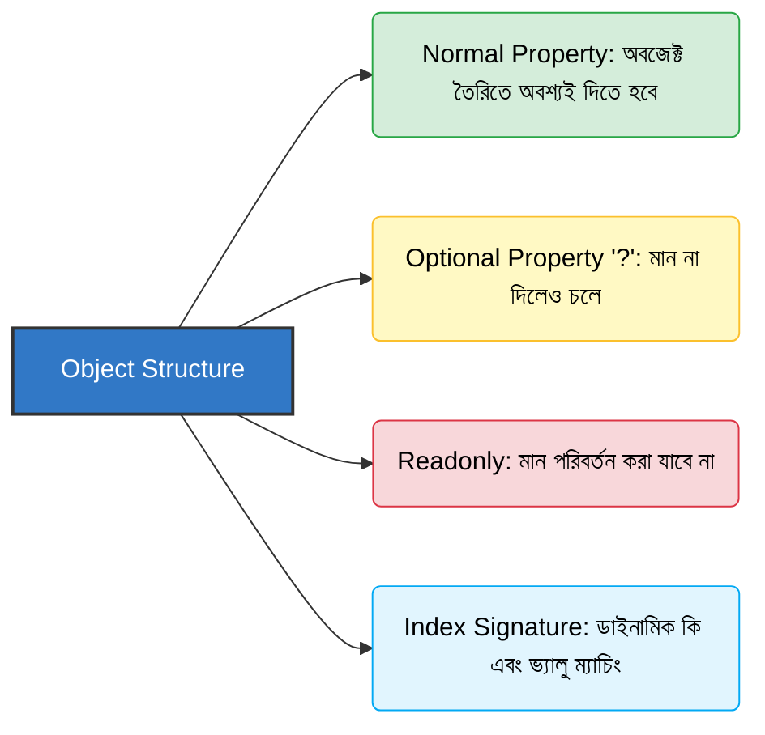

# Chapter 04: Object Types 📦

JavaScript-এর মূল ভিত্তি হলো অবজেক্ট (Objects)। TypeScript-এ অবজেক্টের প্রতিটি প্রপার্টি এবং মেথডের টাইপ কঠোরভাবে নির্ধারণ করে দেওয়া যায়।

---

## Object Schema Architecture (অবজেক্ট স্কিমার উপাদানসমূহ) 📐

নিচের ডায়াগ্রামের মাধ্যমে অবজেক্টের বিভিন্ন ধরণের প্রপার্টি কনফিগারেশন দেখুন:



---

## ১. ইনলাইন অবজেক্ট টাইপিং (Inline Object Typing) ✍️

ভ্যারিয়েবল ডিক্লেয়ার করার সময়ই সরাসরি অবজেক্টের স্ট্রাকচার ডিফাইন করে দেওয়াকে ইনলাইন অবজেক্ট টাইপ বলে।

```typescript
let user: { name: string; age: number } = {
  name: "Atikur",
  age: 25
};
```
*এখানে `user` অবজেক্টে অবশ্যই `name` (যা string) এবং `age` (যা number) থাকতে হবে।*

---

## ২. অপশনাল প্রপার্টি (Optional Property `?`) ⚙️

সব অবজেক্টে সব প্রপার্টি নাও থাকতে পারে। কোনো প্রপার্টিকে ঐচ্ছিক করতে নামের পাশে `?` ব্যবহার করতে হয়।

```typescript
let product: {
  id: number;
  name: string;
  description?: string; // অপশনাল
} = {
  id: 101,
  name: "Smartphone"
}; // এখানে description প্রপার্টি না দিলেও কোড বৈধ।
```

---

## ৩. রিডঅনলি প্রপার্টি (Readonly Property) 🔒

যদি কোনো প্রপার্টির মান শুধুমাত্র একবার সেট করার পর আর কখনো পরিবর্তন করতে না দিতে চান, তবে তার নামের আগে `readonly` কীওয়ার্ড যুক্ত করতে হবে।

```typescript
let userSession: {
  readonly sessionId: string;
  userId: number;
} = {
  sessionId: "sess_99341",
  userId: 42
};

// sessionId পরিবর্তন করতে গেলে এরর হবে:
// userSession.sessionId = "sess_changed"; // Error: Cannot assign to 'sessionId' because it is a read-only property.

userSession.userId = 43; // বৈধ
```

---

## ৪. ইনডেক্স সিগনেচার (Index Signature) 🏷️

কখনো কখনো আমরা অবজেক্টের কী (Keys) বা প্রপার্টির নাম আগে থেকে জানি না, তবে আমরা জানি কী এবং ভ্যালুর টাইপ কী হবে। এই ক্ষেত্রে ইনডেক্স সিগনেচার ব্যবহার করা হয়।

```typescript
let salaryConfig: {
  [employeeName: string]: number; // যেকোনো নামের কী হতে পারে, ভ্যালু অবশ্যই সংখ্যা হতে হবে
} = {
  atik: 50000,
  rahim: 45000,
  karim: 60000
};

salaryConfig["kamal"] = 55000; // বৈধ
// salaryConfig["jabbar"] = "Fifty Thousand"; // Error: Type 'string' is not assignable to type 'number'.
```

---

## ৫. নেস্টেড অবজেক্ট টাইপিং (Nested Object Typing) 🪆

একটি অবজেক্টের মধ্যে আরেকটি অবজেক্ট থাকলে তাদের টাইপও নির্দিষ্ট করে দেওয়া যায়।

```typescript
let employee: {
  id: number;
  name: string;
  address: {
    city: string;
    country: string;
  };
} = {
  id: 1,
  name: "Atik",
  address: {
    city: "Dhaka",
    country: "Bangladesh"
  }
};
```
*নেস্টেড অবজেক্টের ক্ষেত্রে কোড অনেক বড় হয়ে গেলে আমরা কাস্টম টাইপ বা ইন্টারফেস (পরবর্তী চ্যাপ্টারগুলোতে আলোচনা করা হয়েছে) ব্যবহার করতে পারি, যা কোডকে আরও রিইউজেবল এবং রিডেবল করে।*
