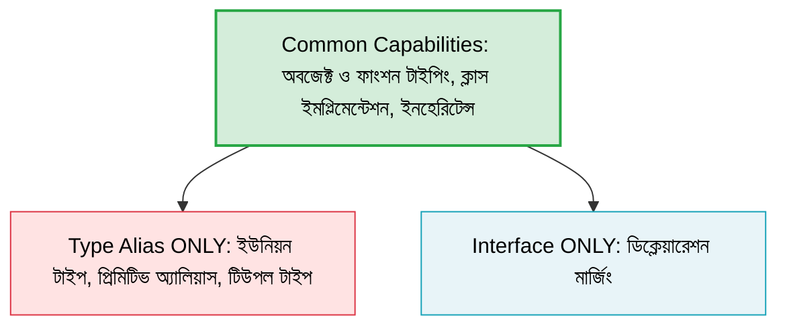

# Chapter 05: Type Aliases vs. Interfaces ⚖️

TypeScript-এ কাস্টম ডাটা টাইপ ডিক্লেয়ার করার জন্য প্রধানত দুটি উপায় রয়েছে: `type` (Type Alias) এবং `interface` (Interface)। 

এই দুটি ফিচারের কাজ প্রায় এক হলেও এদের মধ্যে কিছু গুরুত্বপূর্ণ পার্থক্য এবং নির্দিষ্ট ব্যবহারের ক্ষেত্র রয়েছে।

---

## Core Comparison (প্রধান ধারণাসমূহ) ⚖️

নিচের চিত্রটি টাইপ অ্যালিয়াস এবং ইন্টারফেসের পরিধি ও নির্দিষ্ট ফিচারগুলো তুলে ধরে:



---

## ১. Type Alias কী? 🏷️

`type` হলো টাইপের একটি নতুন নাম বা Alias তৈরি করার পদ্ধতি। এটি অবজেক্ট ছাড়াও প্রিমিটিভ টাইপ, ইউনিয়ন, এবং টিউপল টাইপ ডিফাইন করতে পারে।

> বিস্তারিত জানতে পড়ুন: **[Type Alias Detail Guide](type.md)**

### Syntax:
```typescript
type User = {
  name: string;
  age: number;
};
```

---

## ২. Interface কী? 🧱

`interface` হলো মূলত অবজেক্টের স্ট্রাকচার বা আকৃতি (Shape) কেমন হবে তার চুক্তি বা ব্লুপ্রিন্ট।

> বিস্তারিত জানতে পড়ুন: **[Interface Detail Guide](interface.md)**

### Syntax:
```typescript
interface User {
  name: string;
  age: number;
}
```

---

## ৩. প্রধান পার্থক্যসমূহ 🔍

### ক) Declaration Merging (ইন্টারফেসে সম্ভব, টাইপ-এ সম্ভব নয়)
একই নামের ইন্টারফেস একাধিকবার ডিক্লেয়ার করা হলে TypeScript স্বয়ংক্রিয়ভাবে সেগুলোকে একত্রিত করে।
```typescript
interface User {
  name: string;
}
interface User {
  age: number;
}
// User এখন name এবং age দুটি প্রপার্টিই গ্রহণ করবে
const user: User = { name: "Rahim", age: 25 };
```
*টাইপ অ্যালিয়াস-এ একই নামে পুনরায় ডিক্লেয়ার করতে গেলে কম্পাইলার এরর দিবে।*

### খ) Type Extension (টাইপ বনাম ইন্টারফেস এক্সটেনশন)
- ইন্টারফেস অন্য ইন্টারফেস বা টাইপকে `extends` করতে পারে।
- টাইপ অ্যালিয়াস অন্য টাইপ বা ইন্টারফেসের সাথে যুক্ত হতে ইন্টারসেকশন (`&`) ব্যবহার করে।

#### Interface Extension:
```typescript
interface Person {
  name: string;
}
interface Employee extends Person {
  salary: number;
}
```

#### Type Intersection:
```typescript
type Person = {
  name: string;
};
type Employee = Person & {
  salary: number;
};
```

### গ) Union, Tuple এবং Primitive Alias (শুধুমাত্র টাইপ-এ সম্ভব)
`interface` দিয়ে সরাসরি ইউনিয়ন টাইপ, টিউপল বা প্রিমিটিভ টাইপের জন্য নতুন নাম তৈরি করা যায় না।

```typescript
type ID = string | number; // Union Type
type Point = [number, number]; // Tuple Type
type Name = string; // Primitive Alias
```

---

## ৪. তুলনামূলক টেবিল (Comparison Table) 📊

| Feature | Type Alias (`type`) | Interface (`interface`) |
| :--- | :---: | :---: |
| **Object Structure Define** | ✅ | ✅ |
| **Primitive / Union / Tuple** | ✅ | ❌ |
| **Declaration Merging** | ❌ | ✅ |
| **Extending / Inheriting** | ✅ (via `&` Intersection) | ✅ (via `extends`) |
| **Class Implements** | ✅ | ✅ |
| **Function Signatures** | ✅ | ✅ |

---

## ৫. কখন কোনটি ব্যবহার করবেন? 🤔

### `interface` ব্যবহার করুন যখন:
1. আপনি কোনো অবজেক্টের সাধারণ স্ট্রাকচার ডিফাইন করছেন।
2. আপনি কোনো ক্লাসের সাথে চুক্তি বা কন্ট্রাক্ট তৈরি করছেন (যেমন: `implements InterfaceName`)।
3. আপনি কোনো লাইব্রেরি তৈরি করছেন যেখানে অন্যান্য ডেভেলপারদের টাইপ এক্সটেন্ড করার প্রয়োজন হতে পারে (Declaration Merging-এর জন্য)।

### `type` ব্যবহার করুন যখন:
1. আপনার ইউনিয়ন টাইপ প্রয়োজন (যেমন: `type Status = "success" | "error"`)।
2. আপনার টিউপল টাইপ প্রয়োজন (যেমন: `type Coordinates = [number, number]`)।
3. আপনার জটিল টাইপ কম্পোজিশন বা ম্যাপড টাইপ প্রয়োজন।
