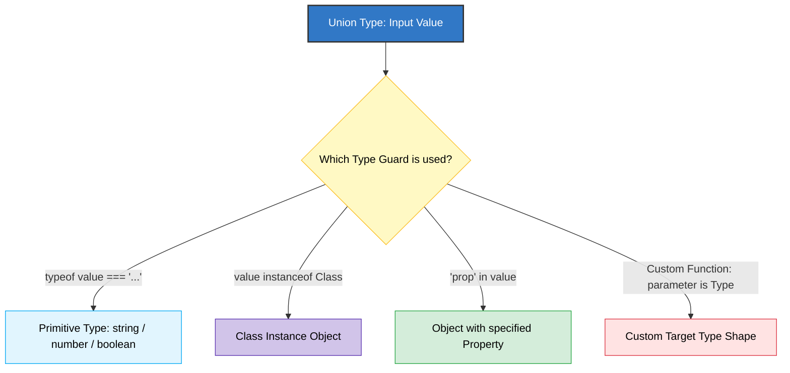

# Chapter 08: Type Guards & Narrowing 🛡️

TypeScript-এ ইউনিয়ন টাইপ ব্যবহারের সময় কম্পাইলারকে সুনির্দিষ্টভাবে বলে দিতে হয় আমরা কোন টাইপ নিয়ে কাজ করছি। সাধারণ টাইপ থেকে সুনির্দিষ্ট টাইপে নামার এই প্রক্রিয়াকে বলা হয় **Type Narrowing**। আর যে উপায়ে বা কন্ডিশনের মাধ্যমে আমরা এটি করি, সেগুলোকে বলে **Type Guards**।

---

## Narrowing Decision Tree (টাইপ ন্যারোইং সিদ্ধান্ত চিত্র) 🛡️

নিচের ডায়াগ্রামের মাধ্যমে টাইপ গার্ডগুলোর সাহায্যে ইউনিয়ন টাইপকে কিভাবে নির্দিষ্ট করা হয় তা দেখুন:



---

## ১. `typeof` টাইপ গার্ড 🧪

প্রিমিটিভ টাইপ (যেমন: `string`, `number`, `boolean` ইত্যাদি) চেক করার জন্য আমরা জাভাস্ক্রিপ্টের বিল্ট-ইন `typeof` অপারেটর ব্যবহার করি।

```typescript
function processInput(input: string | number) {
  if (typeof input === "string") {
    // এখানে TypeScript জানে input অবশ্যই string
    console.log(input.toUpperCase());
  } else {
    // এখানে TypeScript জানে input অবশ্যই number
    console.log(input.toFixed(2));
  }
}
```

---

## ২. `instanceof` টাইপ গার্ড 🏫

ক্লাসের অবজেক্ট বা ইনস্ট্যান্স চেক করার জন্য `instanceof` অপারেটর ব্যবহার করা হয়।

```typescript
class Dog {
  bark() {
    console.log("Woof!");
  }
}

class Cat {
  meow() {
    console.log("Meow!");
  }
}

function playSound(animal: Dog | Cat) {
  if (animal instanceof Dog) {
    animal.bark(); // বৈধ
  } else {
    animal.meow(); // বৈধ
  }
}
```

---

## ৩. `in` অপারেটর টাইপ গার্ড 🔍

কোনো অবজেক্টে নির্দিষ্ট কোনো প্রপার্টি বা কী (Key) আছে কিনা তা চেক করতে `in` অপারেটর ব্যবহার করা হয়। এটি কাস্টম অবজেক্ট টাইপ ন্যারো করতে সাহায্য করে।

```typescript
type Fish = { swim: () => void };
type Bird = { fly: () => void };

function move(animal: Fish | Bird) {
  if ("swim" in animal) {
    // animal-এর মধ্যে swim প্রপার্টি থাকায় এটি Fish
    animal.swim();
  } else {
    // অন্যথায় এটি Bird
    animal.fly();
  }
}
```

---

## ৪. ইউজার-ডিফাইন্ড টাইপ গার্ড (User-defined Type Guards) 🛠️

কখনো কখনো আমাদের নিজস্ব কন্ডিশনাল লজিক দিয়ে টাইপ গার্ড ফাংশন তৈরি করতে হয়। এই ফাংশনগুলোর রিটার্ন টাইপ হিসেবে বিশেষ ধরণের টাইপ প্রেডিকেট (`parameterName is Type`) ব্যবহার করা হয়।

```typescript
type User = { name: string; role: string };
type Guest = { ipAddress: string };

// টাইপ গার্ড ফাংশন (রিটার্ন টাইপ: user is User)
function isUser(person: User | Guest): person is User {
  return (person as User).role !== undefined;
}

function handleAccess(visitor: User | Guest) {
  if (isUser(visitor)) {
    // এখানে TypeScript জানে visitor অবশ্যই User
    console.log(`Welcome back, ${visitor.name}`);
  } else {
    // অন্যথায় visitor অবশ্যই Guest
    console.log(`Logging guest access from IP: ${visitor.ipAddress}`);
  }
}
```
> [!TIP]
> ইউজার-ডিফাইন্ড টাইপ গার্ড জটিল ডাটা স্ট্রাকচার বা API রেসপন্স ভ্যালিডেট করার জন্য অত্যন্ত কার্যকরী।
