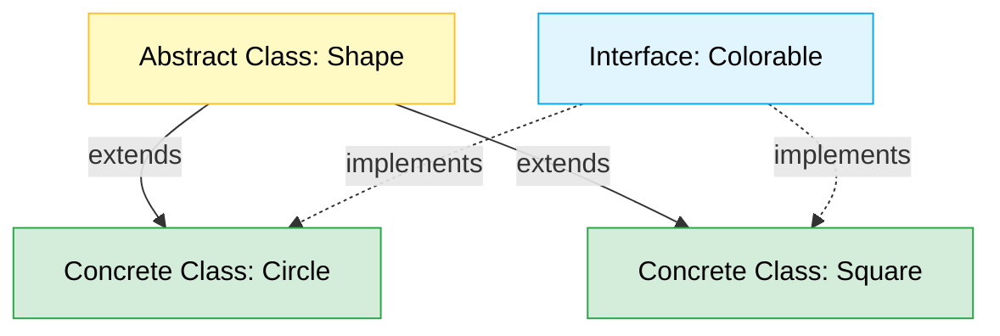

# Chapter 09: Classes & Object-Oriented Programming (OOP) 🏫

TypeScript-এ জাভাস্ক্রিপ্টের ক্লাসগুলোর উপর টাইপ চেকিং এবং ওওপি (OOP)-এর দারুণ সব ফিচার যুক্ত করা হয়েছে। এর মাধ্যমে ক্লাসভিত্তিক ডিজাইন প্যাটার্নগুলো আরও মজবুতভাবে ইমপ্লিমেন্ট করা যায়।

---

## OOP Hierarchy Map (ওওপি ক্লাস হায়ারার্কি ম্যাপ) 🏫

নিচের ডায়াগ্রামের মাধ্যমে ক্লাস রিলেশনশিপ, ইনহেরিটেন্স এবং ইন্টারফেস ইমপ্লিমেন্টেশন ফ্লো দেখুন:



---

## ১. বেসিক ক্লাস (Basic Class Structure) 🏗️

TypeScript-এ ক্লাসের প্রপার্টি ডিক্লেয়ারেশন এবং কনস্ট্রাক্টর লেখার নিয়ম নিচে দেওয়া হলো:

```typescript
class Point {
  x: number; // টাইপ স্পেসিফাই করতে হয়
  y: number;

  constructor(x: number, y: number) {
    this.x = x;
    this.y = y;
  }

  draw() {
    console.log(`X: ${this.x}, Y: ${this.y}`);
  }
}
```

---

## ২. অ্যাক্সেস মডিফায়ার (Access Modifiers) 🔒

TypeScript-এ তিনটি প্রধান অ্যাক্সেস মডিফায়ার রয়েছে, যা প্রপার্টি বা মেথড ব্যবহারের সুযোগ নিয়ন্ত্রণ করে:

1. **`public` (ডিফল্ট)**: ক্লাসের বাইরে যেকোনো জায়গা থেকে অ্যাক্সেস করা যায়।
2. **`private`**: শুধুমাত্র ঐ ক্লাসের ভিতর থেকে অ্যাক্সেস করা যায়। ক্লাসের বাইরে বা সাবক্লাস (Subclass)-এ অ্যাক্সেস করা যায় না।
3. **`protected`**: শুধুমাত্র ঐ ক্লাস এবং তার থেকে তৈরি হওয়া সাবক্লাস (উত্তরাধিকারী ক্লাস)-এর ভিতর থেকে অ্যাক্সেস করা যায়।

```typescript
class Account {
  public name: string;
  private balance: number;
  protected accountType: string;

  constructor(name: string, balance: number, type: string) {
    this.name = name;
    this.balance = balance;
    this.accountType = type;
  }

  showBalance() {
    // ক্লাসের ভিতরে ব্যালেন্স অ্যাক্সেস করা যাচ্ছে:
    console.log(`Balance: ${this.balance}`);
  }
}

const acc = new Account("Atik", 10000, "Savings");
console.log(acc.name); // বৈধ (public)
// console.log(acc.balance); // Error! (private)
// console.log(acc.accountType); // Error! (protected)
```

---

## ৩. কনস্ট্রাক্টর শর্টহ্যান্ড (Parameter Properties) ⚡

কনস্ট্রাক্টরের প্যারামিটারে অ্যাক্সেস মডিফায়ার ব্যবহার করে আমরা খুব সহজে এক লাইনেই প্রপার্টি ডিক্লেয়ার এবং অ্যাসাইন করতে পারি। একে **Parameter Properties** বলে।

### সাধারণ পদ্ধতি:
```typescript
class User {
  name: string;
  constructor(name: string) {
    this.name = name;
  }
}
```

### শর্টহ্যান্ড পদ্ধতি (Shorthand):
```typescript
class User {
  // প্রপার্টি ডিক্লেয়ার বা this.name = name লেখার প্রয়োজন নেই:
  constructor(public name: string, private age: number) {}
}
```

---

## ৪. গেটার এবং সেটার (Getters & Setters) 🔄

ক্লাসের প্রাইভেট মেম্বারদের নিরাপদে অ্যাক্সেস এবং ভ্যালিডেট করতে `get` এবং `set` কীওয়ার্ড ব্যবহার করা হয়।

```typescript
class Employee {
  private _salary: number = 0;

  get salary(): number {
    return this._salary;
  }

  set salary(value: number) {
    if (value < 0) {
      throw new Error("Salary cannot be negative!");
    }
    this._salary = value;
  }
}

const emp = new Employee();
emp.salary = 50000; // সেট হচ্ছে
console.log(emp.salary); // গেট হচ্ছে -> 50000
```

---

## ৫. অ্যাবস্ট্রাক্ট ক্লাস (Abstract Classes) 🏛️

অ্যাবস্ট্রাক্ট ক্লাস হলো এমন ক্লাস যা থেকে সরাসরি কোনো অবজেক্ট বা ইনস্ট্যান্স তৈরি করা যায় না। এটি অন্যান্য ক্লাসের জন্য বেস ক্লাস (Base Class) বা ব্লুপ্রিন্ট হিসেবে কাজ করে। এর ভিতরে অ্যাবস্ট্রাক্ট মেথড থাকতে পারে, যা চাইল্ড ক্লাসে অবশ্যই ইমপ্লিমেন্ট করতে হবে।

```typescript
abstract class Shape {
  constructor(public color: string) {}

  abstract getArea(): number; // চাইল্ড ক্লাসে এই মেথড ইমপ্লিমেন্ট করা বাধ্যতামূলক

  printColor() {
    console.log(`Shape color is ${this.color}`);
  }
}

class Circle extends Shape {
  constructor(public radius: number, color: string) {
    super(color);
  }

  getArea(): number {
    return Math.PI * this.radius * this.radius;
  }
}

const myCircle = new Circle(5, "Red");
console.log(myCircle.getArea()); // বৈধ
```
