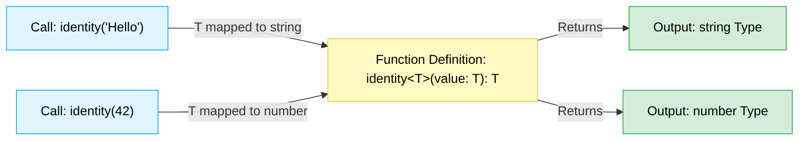

# Chapter 10: Generics 🧬

Generics হলো TypeScript-এর অন্যতম শক্তিশালী ফিচার। এটি ব্যবহার করে আমরা এমন ফাংশন, ইন্টারফেস, ক্লাস বা টাইপ তৈরি করতে পারি যেগুলো বিভিন্ন টাইপের সাথে কাজ করতে পারে কিন্তু টাইপ সেফটি (Type Safety) নষ্ট করে না।

সহজ ভাষায়:
> Generics = টাইপের জন্য ভ্যারিয়েবল (Variable for Types)

---

## How Generics Work (জেনেরিক্স কিভাবে কাজ করে) 🧬

নিচের ডায়াগ্রামের মাধ্যমে দেখুন কিভাবে কল করার সময় জেনেরিক টাইপ প্যারামিটার `T` ইনপুটের সাথে ডাইনামিক্যালি রিপ্লেসড বা পরিবর্তিত হয়:



---

## ১. Generics কেন প্রয়োজন? 🤔

ধরুন, আমরা একটি ফাংশন তৈরি করতে চাই যা ইনপুট হিসেবে যা পাবে, ঠিক সেটাই রিটার্ন করবে।

### Generics ছাড়া (`any` ব্যবহার করে):
```typescript
function identity(value: any): any {
  return value;
}

const result = identity("Hello"); // result-এর টাইপ হলো 'any'
```
*এখানে `any` ব্যবহার করায় টাইপ সেফটি হারিয়ে গেছে। TypeScript জানে না `result` আসলেই একটি স্ট্রিং কিনা।*

### Generics সহ:
```typescript
function identity<T>(value: T): T {
  return value;
}

const result = identity("Hello"); // result-এর টাইপ স্বয়ংক্রিয়ভাবে 'string' হয়ে যায়
```
এখানে `<T>` হলো একটি টাইপ প্যারামিটার (Type Parameter)। যখন আমরা ফাংশনটি কল করি, TypeScript নিজে থেকেই ইনপুটের উপর ভিত্তি করে `T` এর টাইপ নির্ধারণ করে নেয়।

---

## ২. জেনেরিক ইন্টারফেস (Generic Interface) 🧱

বাস্তব প্রজেক্টে এপিআই রেসপন্স হ্যান্ডেল করার জন্য এটি ব্যাপকভাবে ব্যবহৃত হয়।

```typescript
interface ApiResponse<T> {
  success: boolean;
  data: T;
}

interface User {
  id: number;
  name: string;
}

const response: ApiResponse<User> = {
  success: true,
  data: {
    id: 101,
    name: "Atikur"
  }
};
```

---

## ৩. মাল্টিপল জেনেরিক টাইপস (Multiple Generic Types) 🔄

আমরা চাইলে একের অধিক টাইপ ভ্যারিয়েবল ব্যবহার করতে পারি।

```typescript
function createPair<T, U>(first: T, second: U): [T, U] {
  return [first, second];
}

const pair = createPair("Age", 25); // [string, number]
```

---

## ৪. জেনেরিক কনস্ট্রেইন্টস (Generic Constraints `extends`) 🔒

কখনো কখনো আমরা চাই জেনেরিক টাইপটি যেন যেকোনো টাইপ না হয়ে একটি নির্দিষ্ট বৈশিষ্ট্যের অধিকারী হয়। এই ক্ষেত্রে আমরা `extends` কীওয়ার্ড ব্যবহার করি।

```typescript
// T-এর মধ্যে অবশ্যই length প্রপার্টি থাকতে হবে
function getLength<T extends { length: number }>(item: T): number {
  return item.length;
}

getLength("Hello");     // বৈধ (string-এর length আছে)
getLength([1, 2, 3]);   // वैध (array-এর length আছে)
// getLength(100);       // Error! number-এর কোনো length প্রপার্টি নেই।
```

---

## ৫. `keyof` অপারেটর ও Generics 🗝️

কোনো অবজেক্ট এবং তার প্রপার্টির কী (Key) নিয়ে কাজ করার জন্য জেনেরিক্সের সাথে `keyof` ব্যবহার করা হয়। এটি অত্যন্ত জনপ্রিয় একটি অ্যাডভান্সড প্যাটার্ন।

```typescript
function getProperty<T, K extends keyof T>(obj: T, key: K) {
  return obj[key];
}

const user = { name: "Atik", age: 25 };
getProperty(user, "name"); // বৈধ
// getProperty(user, "salary"); // Error! কারণ "salary" প্রপার্টিটি user অবজেক্টে নেই।
```

---

## ৬. জেনেরিক ক্লাস (Generic Class) 🏫

```typescript
class Box<T> {
  private content: T;

  constructor(value: T) {
    this.content = value;
  }

  getContent(): T {
    return this.content;
  }
}

const numBox = new Box<number>(100);
const strBox = new Box<string>("Hello");
```

---

## ৭. কমন নেমিং কনভেনশন (Common Naming Convention) 🏷️

সাধারণত জেনেরিক্সে নিচের অক্ষরগুলো ব্যবহার করা হয়:
- `T` (Type) - যেকোনো সাধারণ টাইপ
- `K` (Key) - অবজেক্টের কী (যেমন: `keyof T`)
- `V` (Value) - অবজেক্টের মান (Value)
- `E` (Element) - অ্যারের উপাদান বা উপাদানসমূহের জন্য
