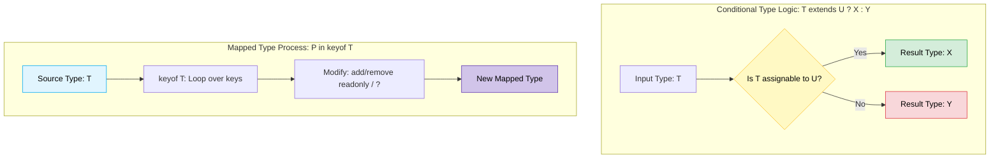

# Chapter 11: Advanced Types 🚀

TypeScript-এর অন্যতম আকর্ষণীয় বিষয় হলো এর চমৎকার টাইপ ম্যানিপুলেশন (Type Manipulation) সিস্টেম। এর মাধ্যমে আমরা এক টাইপ থেকে প্রোগ্রাম্যাটিকভাবে নতুন আরেকটি টাইপ তৈরি করতে পারি। এই চ্যাপ্টারে আমরা শিখবো: **typeof**, **keyof**, **Mapped Types**, এবং **Conditional Types**।

---

## Advanced Type Manipulation Flow (অ্যাডভান্সড টাইপ প্রসেসিং ফ্লো) 🔄

নিচের ডায়াগ্রামের মাধ্যমে কন্ডিশনাল এবং ম্যাপড টাইপের প্রসেসিং লজিক লক্ষ্য করুন:



---

## ১. `typeof` টাইপ অপারেটর (Type Operator) 🧪

জাভাস্ক্রিপ্টের রানটাইম `typeof` ছাড়াও, TypeScript-এ আমরা টাইপ ডিক্লেয়ারেশন অংশে (Type Space) যেকোনো সাধারণ অবজেক্ট বা ভ্যারিয়েবলের টাইপ হুবহু কপি বা রিইউজ করতে `typeof` ব্যবহার করতে পারি।

```typescript
const systemConfig = {
  host: "localhost",
  port: 8080,
  debugMode: true
};

// systemConfig-এর স্ট্রাকচার দেখে টাইপ তৈরি হচ্ছে:
type Config = typeof systemConfig; 
/*
type Config = {
  host: string;
  port: number;
  debugMode: boolean;
}
*/
```

---

## ২. `keyof` টাইপ অপারেটর (Type Operator) 🗝️

`keyof` অপারেটর যেকোনো অবজেক্ট টাইপের সকল প্রপার্টি বা কী (Keys) নিয়ে একটি ইউনিয়ন টাইপ তৈরি করে।

```typescript
type User = {
  id: number;
  name: string;
  email: string;
};

type UserKeys = keyof User; // "id" | "name" | "email"

let key: UserKeys;
key = "name";  // বৈধ
// key = "age"; // Error! কারণ User-এ age নেই।
```

---

## ৩. ম্যাপড টাইপস (Mapped Types) 🗺️

Mapped Types ব্যবহার করে আমরা একটি টাইপের উপর লুপ চালিয়ে (Loop over keys) প্রপার্টিগুলো পরিবর্তন করে সম্পূর্ণ নতুন একটি টাইপ তৈরি করতে পারি। এটি জাভাস্ক্রিপ্টের `map()` মেথডের মতো টাইপের জন্য কাজ করে।

```typescript
type Features = {
  darkMode: boolean;
  notifications: boolean;
};

// Features-এর প্রতিটি প্রপার্টিকে অপশনাল করে দেওয়া হচ্ছে:
type OptionalFeatures = {
  [K in keyof Features]?: Features[K];
};
/*
type OptionalFeatures = {
  darkMode?: boolean;
  notifications?: boolean;
}
*/
```

---

## ৪. কন্ডিশনাল টাইপস (Conditional Types) 🔄❓

কন্ডিশনাল টাইপস আমাদের টাইপের ক্ষেত্রে টার্নারি অপারেটর (`extends ? :`) ব্যবহারের সুযোগ দেয়। অর্থাৎ, ইনপুট টাইপের উপর ভিত্তি করে আউটপুট টাইপ স্বয়ংক্রিয়ভাবে পরিবর্তিত হবে।

```typescript
// যদি T টাইপটি string-এর সাবটাইপ হয় তবে string রিটার্ন করবে, অন্যথায় number
type IsString<T> = T extends string ? "Yes" : "No";

type A = IsString<string>; // "Yes"
type B = IsString<number>; // "No"
```

---

## ৫. `infer` কীওয়ার্ড (The `infer` Keyword) 🧠

Conditional Types-এর ভিতরে কোনো অজানা বা নির্দিষ্ট টাইপকে সনাক্ত করার জন্য `infer` কীওয়ার্ড ব্যবহার করা হয়। এটি সাধারণত কোনো ফাংশনের রিটার্ন টাইপ বা প্যারামিটার টাইপ এক্সট্র্যাক্ট করতে কাজে লাগে।

```typescript
// ফাংশনের রিটার্ন টাইপ এক্সট্র্যাক্ট করার কাস্টম টাইপ:
type GetReturnType<T> = T extends (...args: any[]) => infer R ? R : never;

const getNumber = () => 42;

type Num = GetReturnType<typeof getNumber>; // 'number' টাইপ চলে আসবে
```
> [!NOTE]
> TypeScript-এর অনেক বিল্ট-ইন ইউটিলিটি টাইপ (যেমন: `ReturnType`) মূলত এই `infer` এবং Conditional Types ব্যবহার করেই তৈরি করা হয়েছে।
