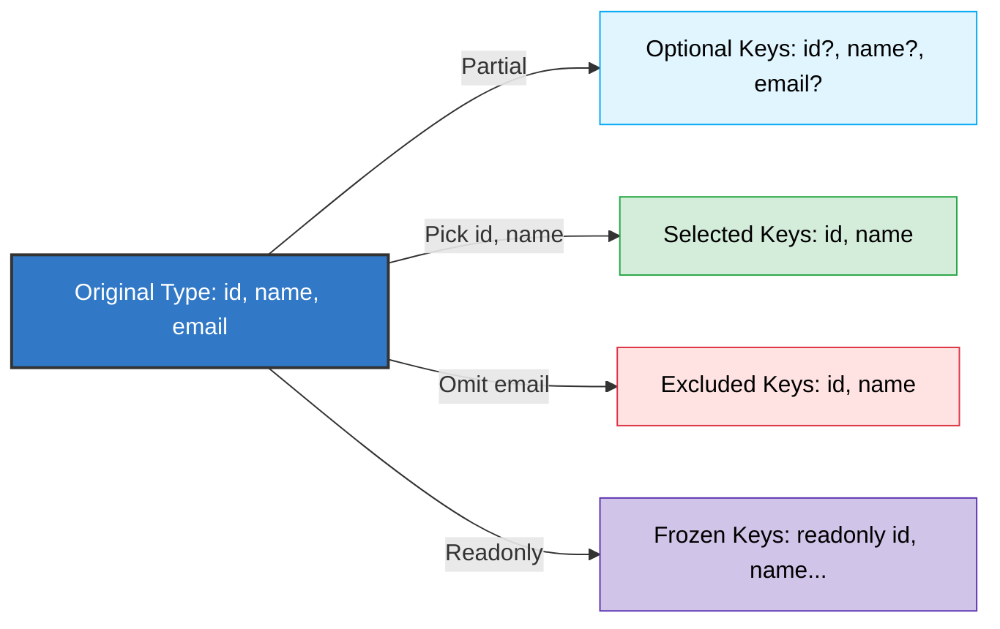

# Chapter 12: Utility Types 🛠️

TypeScript-এ টাইপ নিয়ে সহজে কাজ করার জন্য বেশ কিছু চমৎকার বিল্ট-ইন ইউটিলিটি টাইপ (Built-in Utility Types) রয়েছে। এগুলো ব্যবহার করে বিদ্যমান টাইপ থেকে নতুন আরেকটি টাইপ খুব সহজেই তৈরি বা রূপান্তর করা যায়।

নিচে বহুল ব্যবহৃত ইউটিলিটি টাইপগুলো আলোচনা করা হলো:

---

## Type Transformations (টাইপ রূপান্তর মানচিত্র) 🛠️

নিচের ডায়াগ্রামের মাধ্যমে দেখুন কিভাবে ইউটিলিটি টাইপগুলো কোনো মূল টাইপকে পরিবর্তন বা ফিল্টার করে নতুন টাইপ তৈরি করে:



---

## ১. `Partial<T>` 🧩
একটি টাইপের সকল প্রপার্টিকে অপশনাল (Optional) করার জন্য এটি ব্যবহার করা হয়।

```typescript
interface User {
  id: number;
  name: string;
  email: string;
}

// User-এর সব প্রপার্টি এখন অপশনাল (?):
type PartialUser = Partial<User>; 
/*
type PartialUser = {
  id?: number;
  name?: string;
  email?: string;
}
*/
```

---

## ২. `Required<T>` ❗
একটি টাইপের সকল অপশনাল প্রপার্টিকে বাধ্যতামূলক বা রিকোয়ার্ড (Required) করার জন্য এটি ব্যবহার করা হয়।

```typescript
interface Car {
  brand: string;
  model?: string; // অপশনাল
}

type RequiredCar = Required<Car>; // model এখন বাধ্যতামূলক প্রপার্টি
```

---

## ৩. `Readonly<T>` 🔒
একটি টাইপের সকল প্রপার্টিকে রিড-অনলি (Readonly) করার জন্য এটি ব্যবহার করা হয়। ফলে প্রপার্টিগুলোর মান আর পরিবর্তন করা যায় না।

```typescript
interface Config {
  apiKey: string;
}

const appConfig: Readonly<Config> = { apiKey: "12345" };
// appConfig.apiKey = "67890"; // Error!
```

---

## ৪. `Record<Keys, Type>` 🏷️
নির্দিষ্ট টাইপের কী (Keys) এবং নির্দিষ্ট টাইপের ভ্যালু (Value) দিয়ে অবজেক্ট তৈরি করতে এটি ব্যবহার করা হয়।

```typescript
type Page = "home" | "about" | "contact";

interface PageInfo {
  title: string;
}

const navPages: Record<Page, PageInfo> = {
  home: { title: "Home Page" },
  about: { title: "About Us" },
  contact: { title: "Contact Us" }
};
```

---

## ৫. `Pick<Type, Keys>` 🎯
একটি বিদ্যমান টাইপ থেকে নির্দিষ্ট কিছু প্রপার্টি পছন্দ করে (Pick) সম্পূর্ণ নতুন একটি টাইপ তৈরি করতে এটি ব্যবহার করা হয়।

```typescript
interface Todo {
  title: string;
  description: string;
  completed: boolean;
}

// শুধুমাত্র title এবং completed প্রপার্টি নিয়ে নতুন টাইপ তৈরি:
type TodoPreview = Pick<Todo, "title" | "completed">;
```

---

## ৬. `Omit<Type, Keys>` ✂️
বিদ্যমান কোনো টাইপ থেকে নির্দিষ্ট কিছু প্রপার্টি বাদ দিয়ে (Omit) নতুন একটি টাইপ তৈরি করতে এটি ব্যবহার করা হয়।

```typescript
interface User {
  id: number;
  name: string;
  passwordHash: string; // আমরা এটি বাদ দিতে চাই
}

// passwordHash ছাড়া বাকি সব প্রপার্টি নিয়ে নতুন টাইপ:
type UserWithoutPassword = Omit<User, "passwordHash">;
```

---

## ৭. `Exclude<UnionType, ExcludedMembers>` 🚫
ইউনিয়ন টাইপ থেকে নির্দিষ্ট কিছু টাইপকে বাদ দেওয়ার জন্য এটি ব্যবহার করা হয়।

```typescript
type Status = "active" | "inactive" | "pending" | "deleted";

type ActiveStatusOnly = Exclude<Status, "deleted" | "pending">; 
// ActiveStatusOnly = "active" | "inactive"
```

---

## ৮. `Extract<UnionType, ExtractedMembers>` 🔍
ইউনিয়ন টাইপ থেকে নির্দিষ্ট কিছু কমন বা নির্দিষ্ট টাইপকে বেছে নেওয়ার (Extract) জন্য এটি ব্যবহার করা হয়।

```typescript
type T0 = "a" | "b" | "c";
type T1 = Extract<T0, "a" | "f">; // T1 = "a" (যা দুটি টাইপেই কমন)
```

---

## ৯. `ReturnType<Type>` 🔄
কোনো ফাংশন টাইপের রিটার্ন টাইপটি কী হবে, তা এক্সট্র্যাক্ট বা আলাদা করার জন্য এটি ব্যবহার করা হয়।

```typescript
type MyFunc = () => string;
type FuncReturn = ReturnType<MyFunc>; // FuncReturn = string
```

---

## ১০. `Parameters<Type>` 📋
কোনো ফাংশন টাইপ যেসব প্যারামিটার গ্রহণ করে, সেগুলোর টাইপ একটি টিউপল (Tuple) হিসেবে পাওয়ার জন্য এটি ব্যবহার করা হয়।

```typescript
type ProcessUser = (id: number, name: string) => void;
type ProcessArgs = Parameters<ProcessUser>; // [number, string]
```
