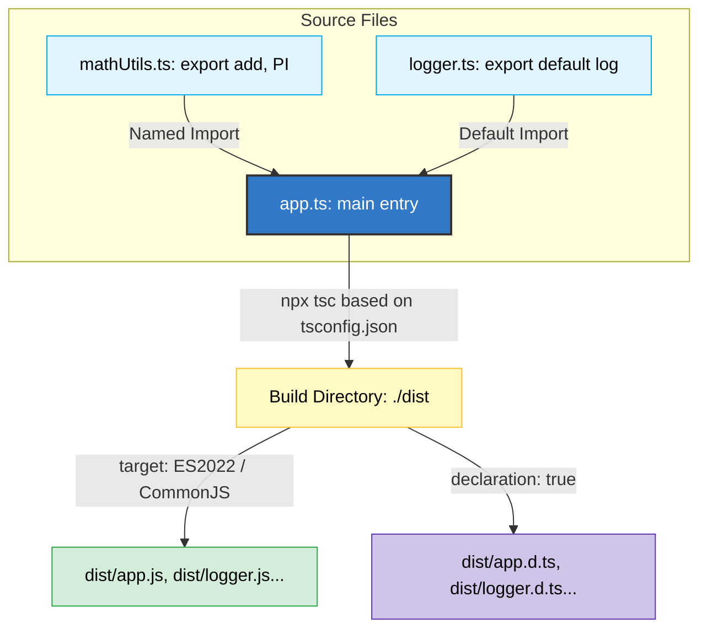

# Chapter 13: tsconfig.json & Modules ⚙️📦

বাস্তব প্রজেক্টে কোড বড় হতে থাকলে আমরা বিভিন্ন ফাইলে কোড বিভক্ত করি। TypeScript-এ মডিউল সিস্টেম এবং `tsconfig.json` কনফিগারেশন খুবই গুরুত্বপূর্ণ বিষয়। এই চ্যাপ্টারে আমরা মডিউল ইমপোর্ট/এক্সপোর্ট এবং `tsconfig.json`-এর গুরুত্বপূর্ণ অপশনসমূহ জানবো।

---

## Module & Build Workflow (মডিউল ও কম্পাইলেশন প্রবাহ) ⚙️📦

নিচের চিত্রের মাধ্যমে ফাইল মডিউল ইমপোর্ট/এক্সপোর্ট এবং `tsconfig.json` আউটপুট প্রসেস লক্ষ্য করুন:



---

## ১. মডিউল সিস্টেম (Modules in TypeScript) 📦

JavaScript-এর ES Modules (ESM) সিস্টেম অনুসরণ করে TypeScript ফাইলের মধ্যে মডিউল ইমপোর্ট ও এক্সপোর্ট করে কাজ করা হয়।

### ক) নেমড এক্সপোর্ট ও ইমপোর্ট (Named Export / Import)
একটি ফাইল থেকে নির্দিষ্ট কোনো অবজেক্ট, টাইপ বা ফাংশন এক্সপোর্ট করতে:

```typescript
// mathUtils.ts
export const add = (a: number, b: number): number => a + b;
export const PI = 3.1416;
```

অন্য ফাইলে এটি ইমপোর্ট করতে:
```typescript
// app.ts
import { add, PI } from "./mathUtils";
console.log(add(5, PI));
```

### খ) ডিফল্ট এক্সপোর্ট (Default Export)
ফাইল থেকে শুধুমাত্র একটি মূল অংশ এক্সপোর্ট করতে `default` ব্যবহার করা হয়:

```typescript
// logger.ts
export default function log(message: string): void {
  console.log(`[Log]: ${message}`);
}
```

ইমপোর্ট করার সময় বন্ধনী `{}` ছাড়া যেকোনো নাম ব্যবহার করা যায়:
```typescript
// app.ts
import myCustomLogger from "./logger";
myCustomLogger("Application started.");
```

---

## ২. tsconfig.json এর বিস্তারিত কনফিগারেশন ⚙️

`tsconfig.json` ফাইলটি নির্ধারণ করে কম্পাইলার কিভাবে TypeScript ফাইলগুলোকে জাভাস্ক্রিপ্টে রূপান্তর করবে।

নিচে অত্যন্ত গুরুত্বপূর্ণ কিছু কম্পাইলার অপশন আলোচনা করা হলো:

```json
{
  "compilerOptions": {
    /* বেসিক সেটআপ */
    "target": "ES2022",           // কোন JS ভার্সনে কোড রূপান্তর হবে
    "module": "CommonJS",         // কোন মডিউল সিস্টেম ব্যবহৃত হবে (CommonJS / NodeNext / ESNext)
    "lib": ["ES2022", "DOM"],     // রানটাইমে কোন লাইব্রেরি এভেইলএবল থাকবে
    
    /* ডিরেক্টরি কনফিগারেশন */
    "rootDir": "./src",           // সোর্স ফাইলের রুট ডিরেক্টরি
    "outDir": "./dist",           // কম্পাইলড JS ফাইলের আউটপুট ডিরেক্টরি
    
    /* টাইপ চেকিং এবং স্ট্রিক্টনেস */
    "strict": true,               // সব স্ট্রিক্ট টাইপ চেকিং অপশন এনাবল করা
    "noImplicitAny": true,        // টাইপ স্পেসিফাই না করলে এরর দেওয়া
    "strictNullChecks": true,     // null বা undefined সরাসরি যেকোনো টাইপে অ্যাসাইন করা বন্ধ করা
    
    /* ইন্টারোপারেবিলিটি */
    "esModuleInterop": true,      // CommonJS ও ES Modules-এর মধ্যে সহজ ইন্টিগ্রেশন
    "skipLibCheck": true,         // টাইপ ডেফিনেশন ফাইলের (.d.ts) টাইপ চেক স্কিপ করা (বিল্ড স্পিড বাড়ায়)
    "forceConsistentCasingInFileNames": true // ফাইলের নামের ক্যাসিং (Case) কনসিস্টেন্ট রাখা
  },
  "include": ["src/**/*"],        // কোন ফাইলগুলো কম্পাইল হবে
  "exclude": ["node_modules"]     // কোন ডিরেক্টরি কম্পাইলেশন থেকে বাদ যাবে
}
```

---

## ৩. ডিক্লেয়ারেশন ফাইল (Declaration Files `.d.ts`) 📄

TypeScript প্রজেক্টে কখনো কখনো এমন কিছু জাভাস্ক্রিপ্ট লাইব্রেরি ব্যবহার করা হয় যেগুলোর নিজস্ব কোনো টাইপ সাপোর্ট নেই (যেমন পুরানো জেকুয়েরি বা কাস্টম স্ক্রিপ্ট)। তাদের টাইপ ডেফিনেশন দেওয়ার জন্য বিশেষ `.d.ts` ফাইল ব্যবহার করা হয়।

### `.d.ts` ফাইলের বৈশিষ্ট্য:
- এতে কোনো ইমপ্লিমেন্টেশন কোড (যেমন: ফাংশনের বডি) থাকে না।
- শুধুমাত্র টাইপ সিগনেচার, ইন্টারফেস বা ক্লাসের ব্লুপ্রিন্ট থাকে।
- উদাহরণস্বরূপ: `globals.d.ts` ফাইলে আমরা গ্লোবাল অবজেক্টের টাইপ ঘোষণা করতে পারি:

```typescript
// globals.d.ts
declare global {
  interface Window {
    appConfig: {
      apiEndpoint: string;
    };
  }
}
export {};
```
এর পর প্রজেক্টের যেকোনো জায়গা থেকে আমরা `window.appConfig.apiEndpoint` টাইপ সেফ উপায়ে ব্যবহার করতে পারবো।
